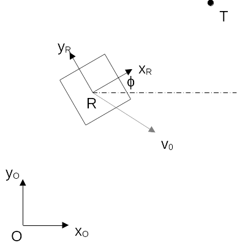

Autoaim Shooting Angle Problem
------------------------------

I'm assuming a constant robot velocity of $v_0$ and a relative
projectile velocity as it leaves the robot of $v_S$ (shooter speed).
The projectile leaves the robot in the $x_R$ direction (relative to the
robot). I'm assuming a wait time (time since autoaim is triggered until
the projectile leaves the robot) of $\Delta t$.

The fact that the projectile must hit the target means that it must
leave the robot in the direction of the target $T$ (direction with
respect to the fixed frame).

### Shooting Position

The position of the robot at the time of shooting is:

$$
R_1 = R_0 + v_0 \Delta t,
$$

where $R_0$ is the robot position when autoaim is triggered.

### Shooting Angle

The projectile will leave the robot with an absolute velocity of:

$$
(v_{0x} + v_S \cos \phi, v_{0y} + v_S \sin \phi).
$$

The vector from the center of the robot at the time of shooting ($R_1$)
to the target ($T$) is:

$$
r = T - R_1.
$$

If the trajectory of the projectile must be in a line that passes
through the target, it means that the two vectors must have the same
direction. This is described (for instance) with:

$$
\frac{r_y}{r_x} = \frac{v_{0y} + v_S \sin \phi}{v_{0x} + v_S \cos \phi}.
$$

We can rearrange as:

$$
r_y v_S \cos \phi - r_x v_S \sin \phi = r_x v_{0y} - r_y v_{0x}.
$$

We can divide both sides by $v_s$ and (let's say) $r_x$:

$$
\frac{r_y}{r_x} \cos \phi - \sin \phi = \frac{v_{0y}}{v_S} - \frac{r_y}{r_x} \frac{v_{0x}}{v_S}.
$$

This leaves us with an equation of the form:

$$
\alpha \cos \phi - \sin \phi = \beta,
$$

where

$$
\alpha = \frac{r_y}{r_x},
$$

and

$$
\beta = \frac{v_{0y}}{v_S} - \alpha \frac{v_{0x}}{v_S}.
$$

Asking Wolfram Alpha to
[solve this kind of equation](https://www.wolframalpha.com/input?i=solve+a*cos%28x%29+%2B+sin%28x%29+%3D+b+for+x)
results in multiple families of solutions (note the $n$ in the equation
below), but only two (note the plus-minus in the equation below) that I
think are relevant:

$$
\phi = 2 \left( \arctan \left( \frac{1 \pm \sqrt{\alpha^2 - \beta^2 + 1}}{\alpha + \beta} \right) + \pi n \right),
$$

with $n \in \mathbb{Z}$.

### Conclusions and Final Notes

 - There is a closed-form solution to the problem, albeit a complicated
   one.

 - Note that there are cases where no solution is available (e.g.
   $\alpha^2 - \beta^2 + 1 < 0$).

 - It may be possible to make some approximations in order to simplify
   the solution (at the expense of accuracy).

 - I worked the problem with a formulation on a fixed frame (moving
   robot with a fixed target). One can formulate the same problem on a
   moving frame (fixed robot with a moving target). Both formulations
   are equivalent.

 - Regardless of the formulation, time of flight does not appear in the
   equations, only the direction of the projectile when it leaves the
   robot determines if it may hit the target.

 - An implementation must check if a solution exists and, if so, which
   of the two kind of solutions is the appropriate one.

 - Consider using [`atan2`](https://en.wikipedia.org/wiki/Atan2) rather
   than `atan` for an implementation.
